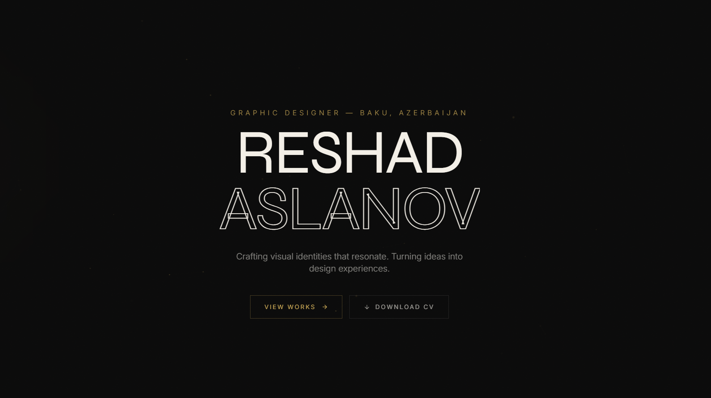

<div align="center">

  

  <br />
  <br />

  # P O R T F O L I O &nbsp; W E B S I T E
  
  <p align="center">
    <b>Developed by Sadık Can Çeşka</b><br>
    <i>Software Developer · Creative Coding · Web Development</i>
  </p>

  <p align="center">
    <a href="#-about">About</a> •
    <a href="#-features">Features</a> •
    <a href="#-tech-stack">Tech Stack</a> •
    <a href="#-gallery">Gallery</a> •
    <a href="#-contact">Contact</a>
  </p>
  
  <br />

  
  
  

</div>

<br />

> **“Crafting visual identities that resonate. Turning ideas into immersive digital experiences.”**

This project is a high-end, interactive portfolio website designed to showcase creative works with a premium, minimalist aesthetic. It features a custom-built design system, smooth animations, and a dark-themed UI with elegant gold accents, reflecting a sophisticated brand identity.

---

## ✨ Features

<table>
  <tr>
    <td width="50%">
      <h3 align="center">🎨 Immersive UI/UX</h3>
      <p align="center">A fully custom interface with a unique cursor system, smooth scrolling (Lenis), and seamless page transitions that keep users engaged.</p>
    </td>
    <td width="50%">
      <h3 align="center">⚡ Interactive Animations</h3>
      <p align="center">Powered by <b>GSAP</b> and <b>ScrollTrigger</b>, the site features advanced reveal effects, parallax scrolling, and a dynamic particle canvas in the hero section.</p>
    </td>
  </tr>
  <tr>
    <td width="50%">
      <h3 align="center">📱 Fully Responsive</h3>
      <p align="center">Optimized for all devices, from large desktop screens to mobile phones, ensuring a consistent premium experience everywhere.</p>
    </td>
    <td width="50%">
      <h3 align="center">🌓 Dark Mode Esthetic</h3>
      <p align="center">A carefully curated dark color palette with <code>#0a0a0a</code> backgrounds and <code>#d4a853</code> (Gold) accents for a luxurious feel.</p>
    </td>
  </tr>
</table>

<br />

## 🛠️ Tech Stack

<div align="center">
  
  
  
  
  
</div>

<br />

## 📸 Selected Works Preview

<div align="center">
  <table>
    <tr>
      <td width="33%"></td>
      <td width="33%"></td>
      <td width="33%"></td>
    </tr>
    <tr>
      <td align="center"><b>Noir Essence</b><br/><i>Branding</i></td>
      <td align="center"><b>Metamorphosis</b><br/><i>Poster</i></td>
      <td align="center"><b>EcoVista</b><br/><i>Digital</i></td>
    </tr>
  </table>
</div>

<br />

## 🚀 Quick Start

To run this project locally:

1.  **Clone the repository**
    ```bash
    git clone https://github.com/yourusername/portfolio-website.git
    ```

2.  **Navigate to the directory**
    ```bash
    cd portfolio-website
    ```

3.  **Run with a local server** (Recommended for ES Modules & Service Workers)
    ```bash
    # Using Python
    python -m http.server 8000
    
    # Or using Node.js
    npx http-server .
    ```

<br />

## 📬 Contact

<div align="center">

  <h3>Sadık Can Çeşka</h3>
  <p><i>Software Developer</i></p>

  <a href="mailto:contact@sadikcanceska.com">
    
  </a>
  <a href="https://discord.gg/zq8mQTeBqA">
    
  </a>
  <a href="https://github.com">
    
  </a>

  <br />
  <br />
  <p>© 2026 Sadık Can Çeşka. All Rights Reserved.</p>

</div>
